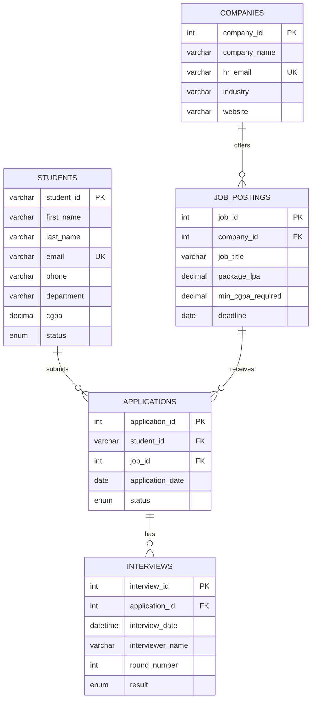

<div align="center">

# 🎓 Campus Placement System

**A DBMS Project — Built with Python & MySQL**

_A complete placement management system to handle students, companies, job postings, applications, and interview rounds — all from a simple command-line interface._

[](https://www.python.org/)
[](https://www.mysql.com/)
[](LICENSE)
[](#contributing)

</div>

---

## 📖 Overview

The **Campus Placement System** is a relational database application designed to streamline the campus recruitment process. It provides a menu-driven CLI to manage the entire placement lifecycle:

> **Student → Application → Interview → Selection**

The project demonstrates core DBMS concepts including **schema design, primary/foreign keys, constraints, multi-table JOINs, and CRUD operations** on a normalized MySQL database.

---

## ✨ Features

| # | Module | What it does |
|:-:|--------|--------------|
| 👨‍🎓 | **Students** | Add and view students with CGPA validation and placement status |
| 🏢 | **Companies** | Register companies and their HR contact details |
| 💼 | **Job Postings** | Post roles with package (LPA), min CGPA and deadline |
| 📄 | **Applications** | Link students to jobs they apply for, track status |
| 🗓️ | **Interviews** | Schedule rounds, record interviewers and results |
| 🔍 | **Reports** | Readable reports generated using multi-table JOINs (up to 5 tables) |

**DBMS highlights used:**

- ✅ `PRIMARY KEY` / `FOREIGN KEY` with `ON DELETE CASCADE`
- ✅ `UNIQUE`, `NOT NULL`, `CHECK`, and `ENUM` constraints
- ✅ `AUTO_INCREMENT` surrogate keys
- ✅ Parameterized queries (SQL injection safe)
- ✅ Normalized schema (3NF) across 5 related tables

---

## 🗂️ Project Structure

```
DBMS-PBL/
├── DBMS PROJECT/
│   └── Campus Placement System/
│       ├── db.py            # MySQL connection helper
│       ├── main.py          # CLI application (menus + CRUD logic)
│       └── placement.sql    # Database schema + tables
├── Campus_Placement_DBMS.pdf
├── Campus_Placement_Review_1_presentation .pptx
├── Campus_Placement_Review_2_presentation.pptx
├── Campus_Placement_Review_3_presentation.pptx
└── README.md
```

---

## 🗃️ Database Schema



| Table | Key Columns | Purpose |
|-------|-------------|---------|
| `students` | `student_id` (PK) | Student records + CGPA constraint (0–10) |
| `companies` | `company_id` (PK, AI) | Recruiting companies |
| `job_postings` | `job_id` (PK, AI), `company_id` (FK) | Jobs offered by companies |
| `applications` | `application_id` (PK, AI), `student_id`, `job_id` (FK) | Student ↔ Job link |
| `interviews` | `interview_id` (PK, AI), `application_id` (FK) | Interview rounds & results |

---

## 🚀 Getting Started

### Prerequisites

- [Python 3.13+](https://www.python.org/downloads/)
- [MySQL 8.0+](https://dev.mysql.com/downloads/mysql/) (or XAMPP / WAMP)
- MySQL Connector: `pip install mysql-connector-python`

### Installation

**1. Clone the repository**

```bash
git clone https://github.com/Farhan8012/DBMS-PBL.git
cd DBMS-PBL
```

**2. Create the database & tables**

```bash
mysql -u root -p < "DBMS PROJECT/Campus Placement System/placement.sql"
```

> Or run `placement.sql` manually in MySQL Workbench / phpMyAdmin.

**3. Configure your credentials**

Open `db.py` and update your MySQL username and password:

```python
connection = mysql.connector.connect(
    host="localhost",
    user="root",          # ← your MySQL username
    password="your_password",  # ← your MySQL password
    database="campus_placement"
)
```

**4. Run the application**

```bash
cd "DBMS PROJECT/Campus Placement System"
python main.py
```

---

## 🕹️ Usage

When you run the app, you'll see this menu:

```
==============================
 CAMPUS PLACEMENT SYSTEM 
==============================
1.  Add a New Student
2.  View All Students
3.  Add a New Company
4.  View All Companies
5.  Add a New Job Posting
6.  View All Job Postings
7.  Add a New Application
8.  View All Applications
9.  Schedule an Interview
10. View All Interviews
11. Exit
```

**Example workflow:**

1. Add a **student** (`STU001`, CGPA, department…)
2. Add a **company** (name, HR email, industry)
3. Create a **job posting** linked to that company
4. Submit an **application** — pick the student and the job
5. Schedule an **interview** for the application
6. View the interview report — a 5-table JOIN showing the full picture 🎉

---

## 📚 Reviews & Deliverables

| Document | Description |
|----------|-------------|
| [📘 Project Report (PDF)](Campus_Placement_DBMS.pdf) | Full project documentation & design |
| [📊 Review 1 Presentation](Campus_Placement_Review_1_presentation%20.pptx) | Problem statement & requirement analysis |
| [📊 Review 2 Presentation](Campus_Placement_Review_2_presentation.pptx) | ER diagram & schema design |
| [📊 Review 3 Presentation](Campus_Placement_Review_3_presentation.pptx) | Implementation & results |

---

## 🛣️ Roadmap

- [ ] Search & filter students by CGPA / department
- [ ] Placement statistics dashboard (placed vs. unplaced)
- [ ] Export reports to CSV / PDF
- [ ] Web interface (Flask / Django)
- [ ] Role-based login (Admin / TPO / Student)

---

## 🤝 Contributing

Contributions are welcome! Fork the repo, create a feature branch, and open a pull request.

```bash
git checkout -b feature/amazing-feature
git commit -m "Add amazing feature"
git push origin feature/amazing-feature
```

---

## 👨‍💻 Author

**Farhan Ansari** — [@Farhan8012](https://github.com/Farhan8012)

---

## 📄 License

This project is for academic purposes under the DBMS course (PBL).

---

<div align="center">
  ⭐ Star this repo if you found it helpful!
</div>
