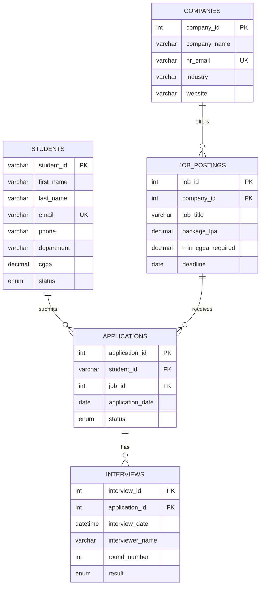

<div align="center">

# 🎓 Campus Placement System

**A Comprehensive DBMS Project — Built with Streamlit, Python & MySQL**

_An end-to-end recruitment management portal to handle students, companies, job postings, applications, and interview rounds — featuring an executive Streamlit web dashboard and a command-line interface._

[](https://www.python.org/)
[](https://streamlit.io/)
[](https://www.mysql.com/)
[](https://plotly.com/)
[](LICENSE)

</div>

---

## 📖 Overview

The **Campus Placement System** is a relational database management application designed to streamline the campus recruitment and training & placement operations. It models and automates the entire placement lifecycle:

> **Student → Job Drive → Eligibility Verification → Application → Interview Rounds → Selection & Automated Placement**

The project demonstrates core DBMS concepts including **schema design, 3NF normalization, primary/foreign keys, ON DELETE CASCADE constraints, CHECK & ENUM validations, database TRIGGERS, SQL VIEWS, multi-table JOINs, and parameterized CRUD operations** on a MySQL database.

---

## 🌟 Modern Streamlit Web Frontend

The project includes an **Executive Streamlit Web Application** designed with modern glassmorphism aesthetics, dark tech styling, responsive layouts, and interactive Plotly analytics:

### 🖥️ Web Portal Modules:
1. 📊 **Executive Analytics & Dashboard**
   - Live KPI cards: Total Registered Students, Placed Students, Overall Placement Rate (%), Recruiting Companies, Active Openings, Highest Package (LPA), and Average Package (LPA).
   - **Interactive Visualizations**:
     - 💼 Package (LPA) breakdown across Companies and Roles.
     - 🎓 Department-wise Placement Rates (Placed vs. Unplaced stacked comparison).
     - 📑 Applications Pipeline Funnel (Applied, Shortlisted, Rejected).
     - 🗓️ Interview Results Breakdown.
   - **Placement Hall of Fame**: Live feed powered by the MySQL `placement_summary` View.

2. 👨‍🎓 **Students Directory**
   - Real-time search by Student ID, Name, or Email.
   - Filtering by Department, Placement Status, and Minimum CGPA cutoff.
   - ➕ Register new students with CGPA & email format validation.
   - ✏️ Edit student records.
   - 🗑️ Safe deletion with cascade warnings.
   - 📥 1-Click CSV export for university administration.

3. 🏢 **Partner Companies**
   - Directory with corporate metrics (Jobs posted, Sector, HR contact details, Website).
   - ➕ Register new recruiting partners.
   - ✏️ Modify company profiles.
   - 🗑️ Company removal with cascade integrity.

4. 💼 **Job Postings & Recruitment Drives**
   - Filter drives by minimum compensation (LPA) and company.
   - Detail cards displaying role, compensation package, minimum CGPA cutoff, and deadlines.
   - ➕ Post new job opportunities.
   - ✏️ Edit salary, deadline, or academic eligibility criteria.
   - 🗑️ Close/remove job postings.

5. 📄 **Applications Pipeline**
   - Complete 4-table relational view of all submissions.
   - ➕ **Smart Academic Eligibility Validator**:
     - Compares candidate's CGPA directly against the job's minimum requirement before submission.
     - Warns if candidate does not meet the academic cutoff.
     - Prevents duplicate applications from the same student for the same role.
   - 🔄 Pipeline status updater (`Applied` → `Shortlisted` → `Rejected`).
   - 🗑️ Withdraw applications.

6. 🗓️ **Interview Management & Selection Tracking**
   - 5-table joined schedule of all interview rounds.
   - ➕ Schedule interview rounds with date/time pickers and interviewer assignment.
   - 🏆 **Automated Placement Trigger**:
     - Updating an interview result to **Selected** automatically triggers database synchronization, marking the student as **Placed** in the `students` table.
     - Celebratory UI animations (`st.balloons()`) and instant confirmation toast.

7. 📑 **Advanced Reports & Multi-Table SQL Views**
   - 🔗 **Master 5-Table JOIN Report**: Complete relational report joining `students`, `companies`, `job_postings`, `applications`, and `interviews`.
   - 👁️ **SQL View Explorer**: Direct access to the database view `placement_summary`.
   - ⚡ **Interactive SQL Explorer**: Run read-only analytical queries with pre-built presets or custom queries.
   - 📥 Export full reports to CSV.

8. ⚙️ **Database Diagnostics & Demo Data Generator**
   - Live MySQL server diagnostics (Host, Port, Version, Connection Status).
   - 🌟 **1-Click Demo Data Generator**: Seeds 8+ diverse students, 5+ global companies (Google, Microsoft, Amazon, Goldman Sachs, TCS), job roles, applications, and interview records with a single click — ideal for viva demonstrations and evaluations!

---

## 🗂️ Project Structure

```
DBMS-PBL/
├── app.py                             # Root launcher for Streamlit Web App
├── DBMS PROJECT/
│   └── Campus Placement System/
│       ├── app.py                     # Main Streamlit Web Application
│       ├── db.py                      # MySQL connection manager & schema helpers
│       ├── main.py                    # Menu-driven Command-Line Interface (CLI)
│       └── placement.sql              # Database schema, triggers & views
├── .streamlit/
│   └── config.toml                    # Streamlit theme & server configuration
├── Campus_Placement_DBMS.pdf          # Complete Project Documentation
├── Campus_Placement_Review_1_presentation .pptx
├── Campus_Placement_Review_2_presentation.pptx
├── Campus_Placement_Review_3_presentation.pptx
└── README.md                          # Project documentation
```

---

## 🗃️ Database Schema



### Table Breakdown

| Table | Key Columns | Purpose & Constraints |
|---|---|---|
| `students` | `student_id` (PK) | Stores student profiles; includes `CHECK (cgpa >= 0 AND cgpa <= 10.0)` |
| `companies` | `company_id` (PK, AI) | Partner recruiting organizations with unique HR emails |
| `job_postings` | `job_id` (PK, AI), `company_id` (FK) | Opportunities posted by companies (`ON DELETE CASCADE`) |
| `applications` | `application_id` (PK, AI), `student_id`, `job_id` (FK) | Relational link tracking applicant status |
| `interviews` | `interview_id` (PK, AI), `application_id` (FK) | Tracks interview rounds, interviewers, and outcomes |

### Triggers & Views Used

- **Trigger `update_student_status`**: Executes `AFTER UPDATE ON interviews` — automatically sets the student's status to `'Placed'` when `result = 'Selected'`.
- **View `placement_summary`**: Multi-table joined view summarizing placed student details, department, hiring company, and offered package (LPA).

---

## 🚀 Getting Started

### Prerequisites

- [Python 3.10+](https://www.python.org/downloads/)
- [MySQL 8.0+](https://dev.mysql.com/downloads/mysql/) (or XAMPP / WAMP / MySQL Workbench)
- Required Python libraries:
  ```bash
  pip install streamlit plotly pandas mysql-connector-python
  ```

### 1. Database Setup

Create the database and run the schema script:

```sql
CREATE DATABASE IF NOT EXISTS campus_placement;
```

Run `placement.sql` into MySQL:

```bash
mysql -u root -p campus_placement < "DBMS PROJECT/Campus Placement System/placement.sql"
```

> Alternatively, open `placement.sql` in MySQL Workbench or phpMyAdmin and execute all statements.

### 2. Configure Database Credentials

The system connects using standard MySQL credentials. You can update `DBMS PROJECT/Campus Placement System/db.py` or set environment variables:

```python
# db.py
DEFAULT_CONFIG = {
    "host": os.getenv("DB_HOST", "localhost"),
    "user": os.getenv("DB_USER", "root"),
    "password": os.getenv("DB_PASSWORD", "Farhan@123"),  # Replace with your MySQL password
    "database": os.getenv("DB_NAME", "campus_placement"),
    "port": int(os.getenv("DB_PORT", 3306))
}
```

---

## 💻 Running the Application

### Option A: Launch the Streamlit Web Application (Recommended)

From the project root directory, run:

```bash
streamlit run app.py
```

Or from the inner folder:

```bash
cd "DBMS PROJECT/Campus Placement System"
streamlit run app.py
```

The web dashboard will automatically open in your default browser at `http://localhost:8501`.

---

### Option B: Launch the Command-Line Interface (CLI)

If you prefer the menu-driven terminal interface:

```bash
cd "DBMS PROJECT/Campus Placement System"
python main.py
```

```text
==============================
 CAMPUS PLACEMENT SYSTEM 
==============================
1.  Add a New Student
2.  View All Students
3.  Add a New Company
4.  View All Companies
5.  Add a New Job Posting
6.  View All Job Postings
7.  Add a New Application
8.  View All Applications
9.  Schedule an Interview
10. View All Interviews
11. Exit
```

---

## 📚 Reviews & Deliverables

| Document | Description |
|---|---|
| [📘 Project Report (PDF)](Campus_Placement_DBMS.pdf) | Complete project documentation, ER diagram, and schema design |
| [📊 Review 1 Presentation](Campus_Placement_Review_1_presentation%20.pptx) | Problem statement & requirement analysis |
| [📊 Review 2 Presentation](Campus_Placement_Review_2_presentation.pptx) | ER diagram, normalization & schema design |
| [📊 Review 3 Presentation](Campus_Placement_Review_3_presentation.pptx) | Implementation, queries & results |

---

## 🛣️ Roadmap

- [x] Search & filter students by CGPA / department
- [x] Placement statistics dashboard (placed vs. unplaced)
- [x] Export reports to CSV
- [x] Web interface (Streamlit Executive Dashboard)
- [x] Automatic placement synchronization via triggers
- [x] 1-Click realistic demo dataset generator

---

## 👨‍💻 Author

**Farhan Ansari** — [@Farhan8012](https://github.com/Farhan8012)

---

## 📄 License

This project is developed for academic purposes under the Database Management Systems Course (PBL).
